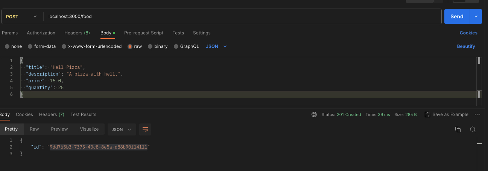

# Food API

The Food API is a RESTful API for managing food items. It allows you to perform operations such as creating, retrieving, updating, and deleting food items.

## Getting Started

### Prerequisites

- Node.js (v18 or above)
- PostgreSQL (v12 or above)

### Technologies
NestJs, PostgreSQL, Docker, TypeORM, Swagger

### Installation

1. Clone the repository:

  ```bash
  git clone https://github.com/arthur-gao/food-api.git
  ```

2. Test the application:
  - Unit test
    ```bash
    npm run test
    ``` 
    ```
    PASS  src/app.controller.spec.ts
    PASS  src/food/mapper/food.mapper.spec.ts
    PASS  src/food/services/food.service.spec.ts

    Test Suites: 3 passed, 3 total
    Tests:       15 passed, 15 total
    Snapshots:   0 total
    ```
  - E2e test
    Pytest + TestContainer + Docker(Postgres),  TestContainer simulate a real database environment in Docker for testing. 
    
    ```bash
    npm run test:e2e
    ``` 
    ```
    App (e2e)
    ✓ should finish a whole life circle (44 ms)
    Test Suites: 1 passed, 1 total
    Tests:       1 passed, 1 total
    Snapshots:   0 total
    Time:        3.148 s
    ```
    *Note*: Only wrtie one e2e test case for demo purpose, more e2e test cases can be added in the future.
    It is:
    - 1). Create a food item
    - 2). Get food item by id
    - 3). Get all food items
    - 4). Buy one food item and validate the quantity is reduced by quantity purchased 

3. Start Docker container:
   ```bash
  cd food-api
  docker-compose up --build
   ```

The Food API should now be running at http://localhost:3000.


4. API Documentation
The API documentation is generated using Swagger. You can access it at http://localhost:3000/api once the application is running.


5. Endpoints
The API provides the following endpoints:

- Retrieve a list of all food items sorted by created_date/price in acending/descending order.
  ```
  GET /food
  ```

  ``` curl  
  curl --location 'localhost:3000/food?sortBy=price&sortOrder=asc'
  ```  


- Retrieve a list of food items by given title/description/price/quantity sorted by created_date/price in acending/descending order.
  ```
  GET /food?title=apple&sortBy=price&sortOrder=asc
  ```

  ``` curl  
  curl --location 'localhost:3000/food?title=Dominion%20Pizza'
  ```  


- Retrieve a specific food item by ID.
  ```
  GET /food/:id 
  ```
  ``` curl  
  curl --location 'localhost:3000/food/f999acdb-6b1a-4be9-9e29-ad16b067bf04'
  ```


- Create a new food item.
  ```
  POST /food
  ```
  ``` curl  
  curl --location 'localhost:3000/food' \
  --header 'Content-Type: application/json' \
  --data '{
    "title": "Hell Pizza",
    "description": "A pizza with hell.",
    "price": 15.0,
    "quantity": 25
  }'
  ```


- Buy a food item (reduces the quantity of that food item by the number purchased)
  ```
  PATCH /food/:id
  ```
  ``` curl  
  curl --location --request PATCH 'localhost:3000/food/f999acdb-6b1a-4be9-9e29-ad16b067bf04' \
  --header 'Content-Type: application/json' \
  --data '{
    "action": "buy",
    "quantity": 1
  }'
  ```


Not implemented yet:
- Replenishment a food item (increases the quantity of that food item by the number purchased)
  ```
  PATCH /food/:id
  ```
  ``` curl  
  curl --location --request PATCH 'localhost:3000/food/f999acdb-6b1a-4be9-9e29-ad16b067bf04' \
  --header 'Content-Type: application/json' \
  --data '{
    "action": "replenishment",
    "quantity": 1
  }'
  ```
